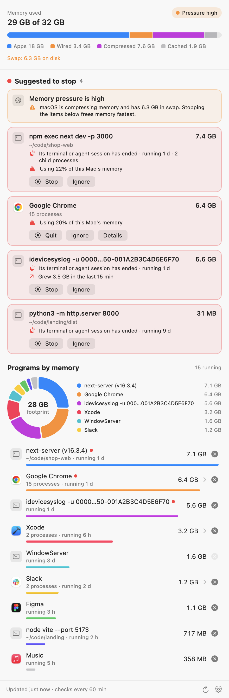
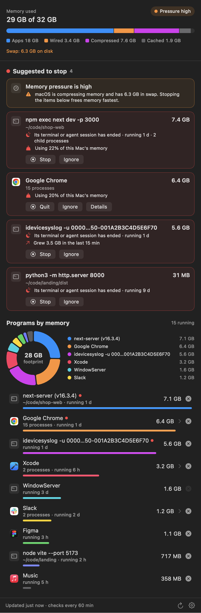
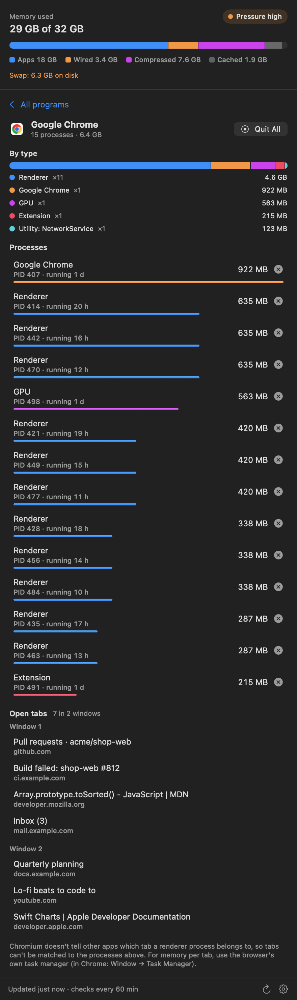

# RamRadar

A small, open-source macOS menu-bar app that shows which programs are using your memory, suggests which ones to stop, and stops them with one click.

<p align="center">
  
  
</p>

## What it does

- **Lives in the menu bar.** A memory-chip icon; a **red dot** appears on it when RamRadar has a suggestion.
- **Checks every 60 minutes** (5, 15, 30 or 60, your choice) and whenever you open it.
- **Shows memory by program**, not by process: Chrome's 180 helper processes count as one "Google Chrome". A donut chart and a ranked list with bars show where the memory is going.
- **Drill into any program** with more than one process: click its row to see the breakdown by type (renderers, GPU, extensions, utility services…) and every process with its PID, age and size. Each one can be stopped on its own.
- **For Chromium browsers** (Chrome, Brave, Edge, Vivaldi, Chromium), the breakdown can also list your open tabs. Chromium doesn't expose which process belongs to which tab, so the list isn't matched to the processes.
- **Suggests what to stop**, with the reason spelled out.
- **Stops it**: apps get a normal Quit (so they can ask to save), command-line processes get `SIGTERM`, and if something is still running after 5 seconds you can Force Quit it. Every stop asks for confirmation first.

<p align="center">
  
</p>

## Why

macOS hides the most common memory leak on a developer's Mac: dev servers and log streams left running after the terminal or AI-agent session that started them has closed. They get re-parented to `launchd`, disappear from every terminal, and keep growing. RamRadar was written after one such `idevicesyslog` stream reached 41 GB and filled 64 GB of swap. `ps` and `top` sorted by RSS showed nothing unusual, because almost all of it was compressed or swapped out.

RamRadar measures **physical footprint** (the "Memory" column in Activity Monitor), which includes compressed and swapped pages, so those processes show up at their real size.

## Suggestions

| Suggestion | When | What Stop does |
|---|---|---|
| **Left over** | A dev tool (`node`, `npm`/`pnpm`/`yarn`, `next-server`, `vite`, `python`, `ruby`, `java`, `bun`, `deno`, `idevicesyslog`, `log stream`, `tail -f`, …) whose parent session has ended (its parent is now `launchd`), owned by you, running for over an hour | Stops it **and its child processes** (e.g. `npm exec next dev` plus the `next-server` it started) |
| **Heavy** | A program using at least 20% of physical memory (capped at 8 GB, so a 64 GB Mac still flags an 8 GB program) | Quits the app or stops the process |
| **Growing** | A program that grew by at least 1 GB **and** 50% since an earlier check at least 10 minutes before | Same |
| **Memory pressure** | macOS itself reports warning or critical pressure | Informational; lists the items above first |

RamRadar never suggests or allows stopping processes owned by other users or system processes it shouldn't touch (WindowServer, Finder, Dock, loginwindow, …). **Ignore** hides one reason for one program; *Settings → Show Ignored Suggestions Again* brings them back.

Heuristics can be wrong. A service you deliberately run under `launchd` (a `brew services` Node app, say) will be flagged as left over. Click Ignore and it stays quiet.

## Install

### From source (recommended for now)

Requires macOS 14 or later and Xcode 15+ (or its command-line tools).

```bash
git clone https://github.com/gemscng/RamRadar.git
cd RamRadar
make install        # builds a universal app and copies it to /Applications
open /Applications/RamRadar.app
```

Turn on *Settings (gear) → Open at Login* to start it automatically.

### Prebuilt download

Tagged releases attach a zipped, universal `RamRadar.app`. It is ad-hoc signed, not notarized, so macOS will block the first launch. Right-click the app and choose **Open**, or run:

```bash
xattr -dr com.apple.quarantine /Applications/RamRadar.app
```

## Command line

The same binary has a few flags that are handy for scripting and debugging:

```bash
RamRadar.app/Contents/MacOS/RamRadar --dump            # print one check and exit
RamRadar.app/Contents/MacOS/RamRadar --snapshot a.png  # render the panel to a PNG (add --dark, or --detail "Google Chrome")
RamRadar.app/Contents/MacOS/RamRadar --demo            # use built-in sample data
```

## Privacy and permissions

- No network access, no analytics, no accounts. Nothing leaves your Mac.
- It reads process information through public APIs (`libproc`, Mach `host_statistics64`, `sysctl`), the same data `ps` and Activity Monitor use. That needs no permission.
- **Show Open Tabs** (in a Chromium browser's breakdown) is the one exception: it asks the browser for its tab titles and addresses over AppleScript, so macOS asks once for Automation permission. Nothing is read until you click it.
- Without admin rights macOS only reveals command lines and working directories for **your** processes; other users' processes appear by name only, and can't be stopped.

## Development

```bash
make test           # 30 unit tests, including real spawn-and-kill tests
make run            # build and open the app
make screenshots    # regenerate docs/ images from demo data
```

See [CONTRIBUTING.md](CONTRIBUTING.md) for the code layout.

## License

[MIT](LICENSE)
